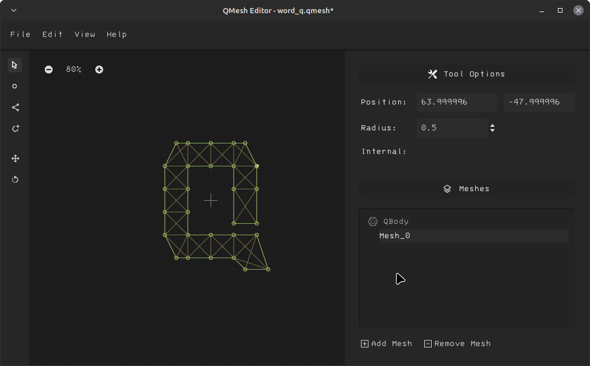

QMeshEditor is an editor app to edit .qmesh files of QuarkPhysics Engine. 

You can create and edit qmesh files and you can load and use these files with QuarkPhysics. 

[QuarkPhysics Project Page](https://github.com/erayzesen/QuarkPhysics)

## Features
* Add/Remove/Edit mesh layers
* Add/Remove/Edit particles
* Add/Remove/Edit springs
* Add/Remove/Edit polygon

## Build project
- Download project
- Open with Godot Engine v3.x.  
- Build to any platform. 

